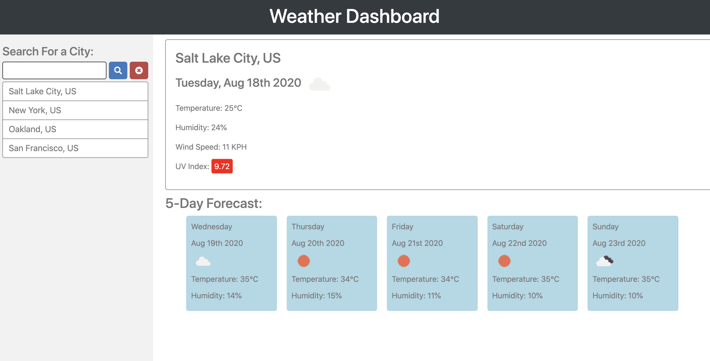

# Bootcamp-Week-6

##Screenshot of Website

## Link to Live

https://marcos-cmd.github.io/weather-dashboard/

## GitHub URL

https://github.com/marcos-cmd/weather-dashboard

## Functions of Weather Dashboard
1. Search input for cities
2. Previously searched cities are saved in search history and local storage
3. Weather conditions show icon, temperature, humidity, wind speed, and uv index
4. UV index changes color based on the severity
5. City's 5-day forecast is also displayed with icons, temperature, and humidity
6. Clicking on city from search history quickly shows the weather for that city again
7. UI nearly matches the demo